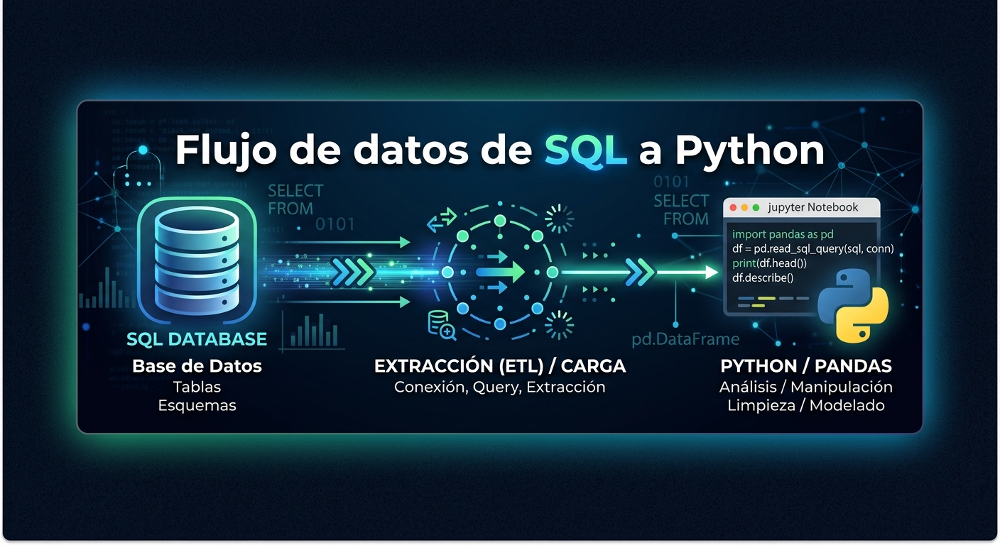

# Flujo de datos de SQL a Python — Olist Marketplace 🛒

## 📝 Descripción del Proyecto

Este proyecto aborda la extracción, modelado y limpieza de los datos transaccionales del marketplace brasileño **Olist** (2016–2018). El objetivo principal consiste en transformar un modelo de datos relacional y transaccional (OLTP) en un **conjunto de datos analítico (OLAP)** optimizado para responder a preguntas clave de negocio, automatizaciones ETL y la posterior construcción de cuadros de mando analíticos.

El flujo de trabajo se divide en dos grandes bloques:
1. **Modelado y Limpieza en SQL:** Creación de dataframes exploratorios y definición de una consulta analítica estandarizada y agregada.
2. **Procesamiento y Limpieza Final en Python:** Validación de tipos, tratamiento de atípicos, ingeniería de características y exportación optimizada.

---

## 👥 Equipo e Integrantes

* **Integrantes del equipo:**
  * Carol Rueda
  * Anthony Rodriguez
  * Miguel López

---

## 📌 Definición Estratégica del Dataframe seleccionado

### Dataframe 1: Actividad de clientes

> **Grano declarado:**  
> **«XXXXXXXX.»**

* **Clave Primaria Compuesta:** `(«XXXXXXXX)`

### Dataframe 2: Catálogo de productos

> **Grano declarado:**  
> **««XXXXXXXX.»**

* **Clave Primaria Compuesta:** `(«XXXXXXXX)`

### Dataframe 3: Vendedores y popularidad

> **Grano declarado:**  
> **«Una fila representa la actividad acumulada de un producto único comercializado por un vendedor específico.»**

* **Clave Primaria Compuesta:** `(seller_id, product_id)`

---

## 🎯 KPIs y Métricas de Negocio

El dataset preparado permite monitorear y evaluar los siguientes Indicadores Clave de Rendimiento (KPIs):

1. **Unidades Vendidas por Producto (`unidades_vendidas_producto`):** Frecuencia de movimiento de cada artículo en el catálogo de un vendedor.
2. **Número de Pedidos Distintos (`pedidos_distintos_producto`):** Penetración del producto en pedidos únicos (evita duplicidades por cantidad).
3. **Facturación por Producto (`ingreso_total_producto`):** Volumen monetario total aportado por un producto específico a las ventas de un vendedor.
4. **Ranking de Popularidad (`ranking_producto_en_vendedor`):** Posición relativa del producto según la preferencia de compra dentro del catálogo de un vendedor.
5. **Concentración de Catálogo:** Proporción del volumen de ventas generado por los productos top en comparación con el resto del inventario.

---

## 🛠️ Extracción y Limpieza en SQL

### Criterios y Reglas de Negocio Aplicadas
* **Estandarización de cadenas:** Aplicación de `LOWER(TRIM())` en `seller_city` y `seller_state` para corregir inconsistencias tipográficas y de formato.
* **Integridad referencial:** Integración mediante `INNER JOIN` entre `sellers`, `order_items` y `products`, garantizando que únicamente se analicen registros activos y válidos.
* **Manejo de duplicidad por ítem:** `order_items` almacena cada unidad vendida como un registro independiente. Se implementó `COUNT(DISTINCT order_id)` para contabilizar la cantidad real de transacciones sin sobreestimar el volumen de pedidos.
* **Productos sin ventas:** Se excluyen los productos del catálogo que no han registrado ventas para centrar el modelo en la actividad económica activa y no distorsionar los cálculos de rendimiento.

### 📄 Consulta SQL Final (`query_vendedores_popularidad.sql`)

```sql
SELECT 
    LOWER(TRIM(s.seller_city)) AS seller_city_clean,
    LOWER(TRIM(s.seller_state)) AS seller_state_clean,
    s.seller_id,
    p.product_id,
    p.product_category_name,
    COUNT(oi.order_item_id) AS unidades_vendidas_producto,
    COUNT(DISTINCT oi.order_id) AS pedidos_distintos_producto,
    ROUND(SUM(oi.price), 2) AS ingreso_total_producto,
    DENSE_RANK() OVER (
        PARTITION BY s.seller_id 
        ORDER BY COUNT(oi.order_item_id) DESC, SUM(oi.price) DESC
    ) AS ranking_producto_en_vendedor
FROM sellers s
INNER JOIN order_items oi 
    ON s.seller_id = oi.seller_id
INNER JOIN products p 
    ON oi.product_id = p.product_id
GROUP BY 
    LOWER(TRIM(s.seller_city)),
    LOWER(TRIM(s.seller_state)),
    s.seller_id,
    p.product_id,
    p.product_category_name
ORDER BY 
    unidades_vendidas_producto DESC,
    ingreso_total_producto DESC;
```

---

## 🐍 Procesamiento y Limpieza en Python (Google Colab)

El procesamiento del dataframe exportado se llevó a cabo dentro del notebook Jupyter en Google Colab siguiendo las siguientes etapas:

1. **Carga e Inspección Inicial:** Verificación del número de registros, estructura del dataset e identificación del uso de memoria.
2. **Normalización de Tipos de Datos:** Conversión explícita de campos identificadores a tipo cadena (`string`) y métricas numéricas a enteros/flotantes (`int64`, `float64`).
3. **Tratamiento de Valores Nulos:** Imputación de categorías desconocidas en `product_category_name` mediante el valor por defecto `'sin_categoria'`.
4. **Validación de Inconsistencias y Duplicados:** Confirmación de la inexistencia de filas duplicadas en la combinación `(seller_id, product_id)`.
5. **Análisis de Outliers:** Identificación de valores atípicos en precios e ingresos agrupados a través de diagramas de caja (boxplots) e histogramas.
6. **Ingeniería de Características (Columnas Derivadas):**
   * **`precio_promedio_unidad`:** Calculado como `ingreso_total_producto / unidades_vendidas_producto`.
   * **`es_top_vendedor`:** Indicador booleano (`True`/`False`) que identifica si el producto ocupa el puesto número 1 en ventas dentro del catálogo del vendedor.

---

## 🗂️ Estructura del Repositorio

```
.
├── sql/                               ← las TRES consultas, en SQL Workbench
│   ├── df1_actividad_clientes.sql
│   ├── df2_catalogo_productos.sql
│   └── df3_vendedores_popularidad.sql
│
├── src/                               ← el código, en VS Code
│   ├── config.py                        lee las credenciales del .env
│   └── main.py                          conecta, consulta y exporta el CSV
│
├── notebooks/
│   └── limpieza.ipynb                 ← la limpieza final, en Colab o VS Code
│
├── data/                              ← el CSV exportado. NO se sube
│   └── .gitkeep
│
├── .env                               ← vuestras credenciales. NO se sube
├── .env_example                         plantilla del anterior, SÍ se sube
├── .gitignore
├── requirements.txt
└── README.md                          ← documentad aquí vuestras decisiones
```

---

## 🚀 Instrucciones de Ejecución

1. **Configuración de la Base de Datos (MySQL)
   * **Descargar e importar el archivo olist.sql.gz en tu gestor de base de datos MySQL local:

```bash

gunzip -c olist.sql.gz | mysql -u root -p
```

   * **Ejecutar la consulta almacenada en sql/query_vendedores_popularidad.sql para generar la tabla analítica preliminar.
   * **Exportar el resultado en formato .csv (por ejemplo, dataframe_vendedores_limpio.csv).
2. **Ejecución del Notebook en Google Colab**
   * **Abrir Google Colab y subir el notebook notebooks/Olist_Cleaning_Python.ipynb.
   * **Cargar el archivo CSV exportado desde SQL en el entorno de trabajo del notebook.
   * **Ejecutar de forma secuencial todas las celdas del notebook para generar los análisis, visualizaciones y la versión final del dataset procesado.

---

## 📋 Checklist de Limpieza (Python)

- [x] Verificación de tipos de datos y conversión adecuada.
- [x] Detección y tratamiento de valores duplicados.
- [x] Tratamiento de datos faltantes (nulos).
- [x] Estandarización de texto (cadenas sin espacios y en minúsculas).
- [x] Detección e inspección visual de outliers.
- [x] Creación de columnas derivadas útiles para negocio.
- [x] Generación de visualizaciones explicativas y de validación.
- [x] Exportación del dataset procesado en formato final.